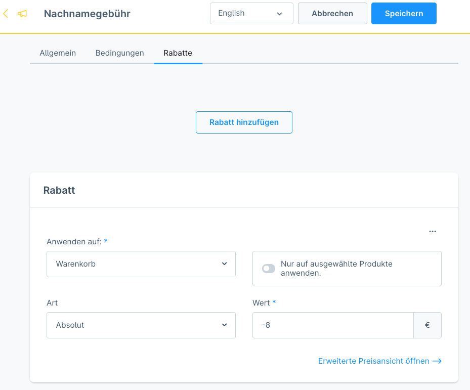
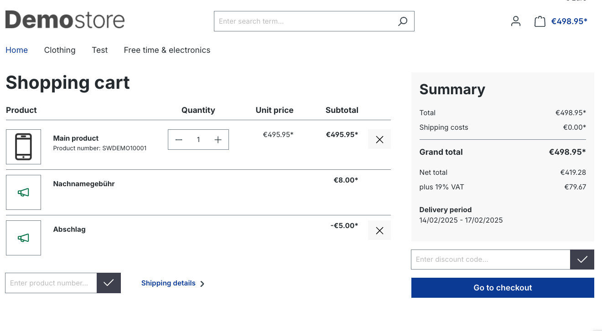

# Shopware 6 Plugin: Rabatte

## Unterstützte Shopware Versionen und Changelog

Stand 13.02.2025:
- **6.6.4.0 - 6.6.9.0**

Version 1.0.0 - 13.02.2025
- Initiale Version

## Hauptfunktionen des Plugins
Bei den absoluten Rabatten können Minuswerte eingetragen und damit Zuschläge realisiert werden.

Diese werden dann umgekehrt als Zuschlag berechnet.

Wir bieten zu unseren Open-Source-Plugins kostenpflichtigen Support and

* [Online-Formular](https://www.area-net.de/kontakt)
* [shopware@area-net.de](mailto:shopware@area-net.de)

## Shopware Theme und Plugins

Neben kostenlosen Open-Source Shopware-Plugins bietet die Shopware-Agentur auch Themes und Plugins im Shopware-Store an:

- [aloha Theme](https://store.shopware.com/en/arean62788672693m/a-better-cms-theme-optimized-checkout-b2b-functions-flexibly-customizable.html) mit optimiertem Checkout
- [aloha CMS Elements](https://store.shopware.com/arean13931131788m/a-better-cms-elements-slider-bilder-html5-video-google-maps-vorher-nachher-bilder.html) mit umfangreichen Erweiterungen der Standard-Inhaltselemente
- [Pagespeed Booster](https://store.shopware.com/arean41766445685m/pagespeed-booster-paypal-und-externe-skripte-auf-der-startseite-deaktivieren.html) deaktiviert PayPal und Co. auf der Startseite
- [Optimierte Inhaltsbearbeitung](https://store.shopware.com/arean36129443353f/optimierte-inhaltsbearbeitung-inhalte-nur-im-designer-bearbeiten-inhalte-in-layout-uebertragen.html) für CMS-Seiten und Kategorien
- [HTTP-Auth](https://store.shopware.com/arean97586892435f/http-authentifizierung-fuer-verkaufskanaele.html) für Verkaufskanäle

## AREA-NET GmbH
Die AREA-NET GmbH ist Shopware Partner Agentur und Shopware Hersteller, sowie Pickware Partner aus dem Großraum Stuttgart in Baden-Württemberg/Deutschland.

**Adresse**\
Öschstrasse 33\
73072 Donzdorf

Telefon: +49 (0)7162 - 941140\
Mail: [shopware@area-net.de](mailto:shopware@area-net.de)\
Web: [www.area-net.de](https://www.area-net)

Mehr Informationen, Projektanfragen und Support gibt es auf der Website der [Shopware-Agentur AREA-NET GmbH](https://www.area-net.de).

**Follow us**

- https://linkedin.com/companyarea-net-gmbh-shopware-agentur
- https://www.facebook.com/area.net.gmbh
